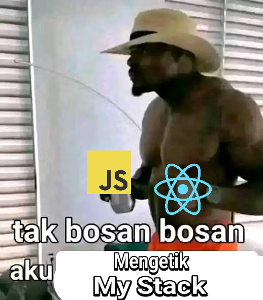
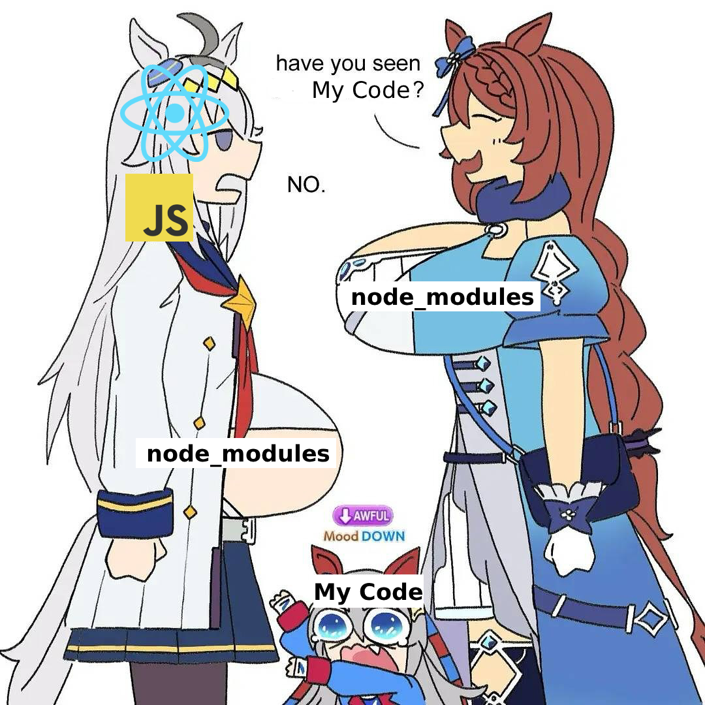
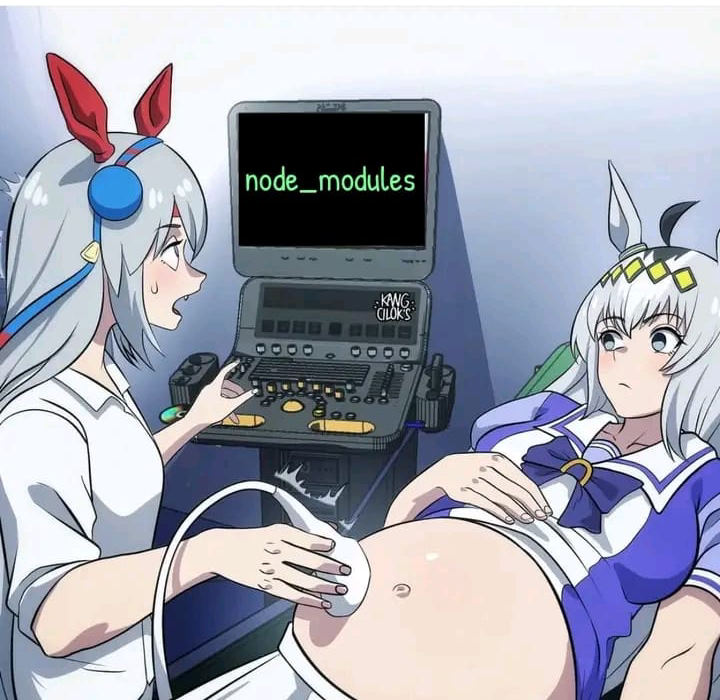

<!-- README.md -->

  

<h2 align="center">🚀 Forking Jeremi Herodian Abednigo</h2>
<h4 align="center">Experiment account — Forking projects from my original account</h4>

  

  <em>“Bukankah ini my stack?”</em>

  
  
   

---

  © 2025 Jeremi Herodian Abednigo — Forked for experimentation and learning.

